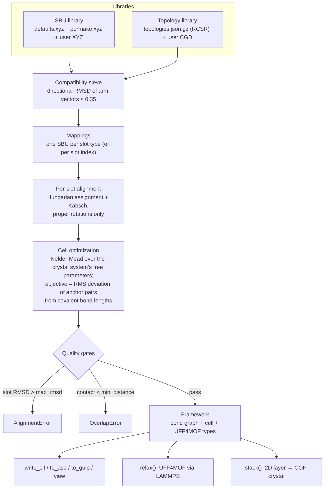
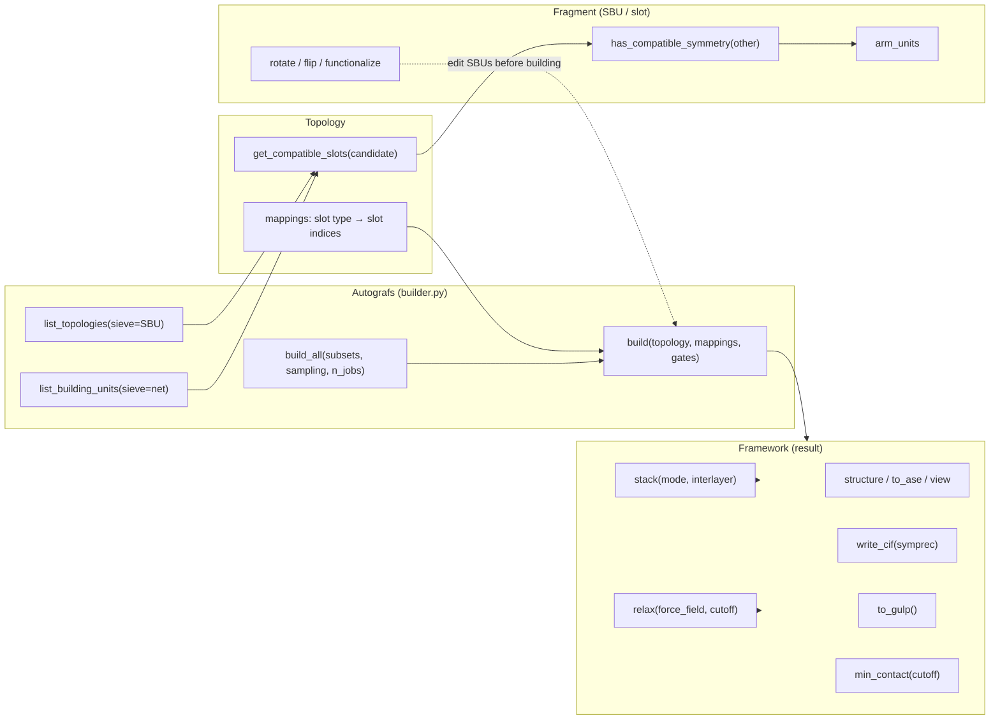
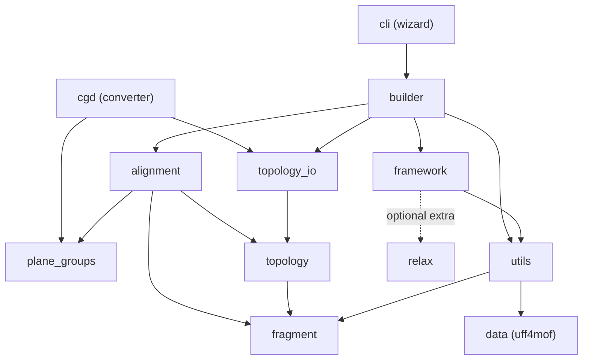

# AuToGraFS

[](https://pypi.org/project/AuToGraFS/)
[](https://pypi.org/project/AuToGraFS/)
[](https://github.com/DCoupry/autografs/actions/workflows/ci.yml)
[](https://codecov.io/gh/DCoupry/autografs)
[](https://github.com/DCoupry/autografs/blob/master/LICENSE.txt)

**AuToGraFS** — the *Automatic Topological Generator for Framework Structures* —
generates Metal-Organic Frameworks (MOFs), Covalent Organic Frameworks (COFs)
and other periodic framework materials by mapping molecular building blocks
(SBUs) onto topological blueprints (nets).

```python
from autografs import Autografs

mofgen = Autografs()
pcu = mofgen.topologies["pcu"]
mof = mofgen.build(pcu, mappings={
    slot: "Zn_mof5_octahedral" if len(slot.atoms.indices_from_symbol("X")) == 6
    else "Benzene_linear"
    for slot in pcu.mappings
})
mof.write_cif("mof5.cif")   # cubic, a = 12.89 A (experiment: 12.9)
```

Original publication: [*"Automatic Topological Generator for Framework
Structures"*](http://pubs.acs.org/doi/abs/10.1021/jp507643v),
Addicoat, Coupry & Heine, *J. Phys. Chem. A* 2014, 118 (40), 9607.

---

**Contents** —
[Why AuToGraFS?](#why-autografs) ·
[Installation](#installation) ·
[Quickstart](#quickstart-mof-5) ·
[Command line](#the-command-line-interface) ·
[How it works](#how-it-works) ·
[Architecture](#repository-architecture) ·
[Python API tour](#python-api-tour) ·
[Custom building blocks](#custom-building-blocks-sbus) ·
[Custom topologies](#custom-topologies) ·
[Library coverage](#library-coverage) ·
[Development](#development) ·
[Citing](#citing)

---

## Why AuToGraFS?

Several excellent framework assemblers exist — notably
[PORMAKE](https://github.com/Sangwon91/PORMAKE) (Lee *et al.*, whose MIT-licensed
building-block library AuToGraFS gratefully bundles) and
[ToBaCCo](https://github.com/tobacco-mofs/tobacco_3.0) (Colón / Gómez-Gualdrón
groups). AuToGraFS was one of the first tools in this space (2014) and version 3
is a ground-up rewrite around a small set of design choices:

- **Works out of the box.** `pip install AuToGraFS` ships **2686 RCSR
  topologies** and **930 building blocks** (63 curated SBUs + the 867-block
  PORMAKE library, 2- to 24-connected). No database generation step, no
  external binaries for building. **96.5 % of the shipped topologies are
  buildable immediately** (see [Library coverage](#library-coverage)).
- **2D nets are first-class.** The 200 RCSR layer nets (hcb, sql, kgm, ...)
  that COF chemistry builds on are stored as plane-group topologies; a build
  produces a flat layer, and `Framework.stack()` turns it into a bulk crystal
  with AA / AB / serrated / staggered stacking at a chosen interlayer spacing.
- **Geometry, not symmetry tables.** SBUs are matched to slots by optimally
  rotating their connection vectors onto the slot's (Hungarian assignment +
  Kabsch, *proper rotations only* — chiral building blocks are never silently
  mirrored). Point-group labels are metadata, not gates, so low-symmetry (C1)
  vertices stay usable.
- **Physically meaningful cells.** The cell is optimized so that every
  inter-SBU bond sits at its covalent (Cordero) bond length, with the crystal
  system's constraints enforced (a cubic net optimizes a single length).
  MOF-5 comes out cubic at 12.89 Å against the experimental 12.9 — *before*
  any force-field relaxation.
- **Fails loudly, never silently.** Optional hard gates (`max_rmsd`,
  `min_distance`) raise typed exceptions instead of returning distorted or
  interpenetrating structures. Identical inputs give identical outputs.
- **Post-processing built in.** UFF4MOF assignment on every output, GULP input
  generation, and one-call in-process LAMMPS relaxation
  (`pip install "autografs[relax]"`).
- **Safe, versioned data formats.** Topology libraries are plain JSON
  (diffable, shareable, survives pymatgen upgrades) — not pickles.
- **A guided CLI.** The `autografs` wizard walks through
  topology → SBUs → build → stack → export without writing a script.
- **MIT licensed**, pure-Python installation on Linux / macOS / Windows.

If you need features AuToGraFS doesn't have yet (see
[Roadmap](#roadmap)), PORMAKE and ToBaCCo are actively maintained and may fit
better — comparisons age quickly, so evaluate against their current versions.

## Installation

```bash
pip install AuToGraFS
```

Requires Python ≥ 3.11. Core dependencies: pymatgen, ASE, numpy, scipy,
networkx.

Optional extras:

```bash
pip install "autografs[relax]"   # UFF4MOF relaxation via LAMMPS
```

On Windows, the LAMMPS wheel additionally needs the Microsoft MPI runtime
(`winget install Microsoft.MSMPI`).

Development install:

```bash
git clone https://github.com/DCoupry/autografs.git
cd autografs
pip install -e ".[dev]"
```

## Quickstart: MOF-5

```python
from autografs import Autografs

mofgen = Autografs()

# what fits the pcu net?
available = mofgen.list_building_units(sieve="pcu")
for slot_type, sbu_names in available.items():
    print(slot_type, len(sbu_names), "candidates")
# Oh 6 : ... candidates      (the octahedral node)
# D*h 2 : ... candidates     (the linear edge)

# pick one SBU per slot type
topology = mofgen.topologies["pcu"]
mappings = {}
for slot_type in topology.mappings:
    n_connections = len(slot_type.atoms.indices_from_symbol("X"))
    if n_connections == 6:
        mappings[slot_type] = "Zn_mof5_octahedral"
    else:
        mappings[slot_type] = "Benzene_linear"

mof = mofgen.build(topology, mappings=mappings)
print(mof)
# Framework('pcu', 'Zn4 H12 C24 O13', abc=(12.89, 12.89, 12.89))

mof.write_cif("mof5.cif")
```

## The command line interface

Two console commands are installed with the package.

### `autografs` — interactive wizard

```bash
autografs                       # bundled libraries
autografs --xyz my_sbus.xyz     # add custom building blocks
autografs --topofile my_topologies.json.gz
```

A guided session covers the whole workflow without writing a script:

- **Build a structure** — filter the nets (3D / 2D, by slot connectivity),
  type-to-search a topology, inspect its cell / symmetry / slot types, pick a
  compatible SBU per slot type (only compatible candidates are offered), set
  the build options, and export. Failed alignments drop into a recovery loop
  (relax the gate, or swap SBUs) instead of dying.
- **Browse topologies** — summary table per net plus every compatible SBU per
  slot type.
- **Browse building units** — composition, connectivity, dummy point group,
  and how many nets the SBU fits.
- **Batch build** — a front-end for `build_all`: pick a topology subset, cap
  the combinations per topology, and write every resulting CIF to a directory.
- 2D layer builds offer **COF stacking** (AA / AB / serrated / staggered,
  chosen interlayer spacing) before export.
- Export formats: CIF, GULP input (UFF4MOF optimization), or straight into the
  ASE viewer.

Non-interactive `--topology`/`--sbu` flags are deliberately not provided:
addressing slot types from a flag is ambiguous on nets with several
same-connectivity orbits, and scripted use is what the Python API and
`build_all` are for.

### `autografs-topologies` — topology library generator

```bash
# regenerate the full RCSR library
autografs-topologies --use_rcsr -o topologies.json.gz

# convert your own CGD nets (optionally merged with RCSR)
autografs-topologies -i my_nets.cgd -o my_topologies.json.gz
autografs-topologies -i my_nets.cgd --use_rcsr -o combined.json.gz

# admit vertices above the default 24-connected cap
autografs-topologies --use_rcsr --max-connectivity 32 -o big.json.gz
```

See [Custom topologies](#custom-topologies) for the input format.

## How it works

### The idea (the 2014 paper)

The founding insight of the [original
publication](http://pubs.acs.org/doi/abs/10.1021/jp507643v) is a strict
separation of *chemistry* from *connectivity*. A crystalline framework is
described as a **topological blueprint** — a periodic net whose vertices and
edges are abstract *slots* annotated with connection points — plus a set of
**molecular building blocks** whose own connection points are marked by
placeholder "dummy" atoms. Generating a structure then reduces to a geometry
problem: pick a building block whose connection figure matches each slot,
align it onto the slot, and scale the cell so the blocks meet at bonding
distance. Because the blueprint is reusable, one net yields a whole
combinatorial family of hypothetical materials — MOFs, COFs, ZIFs — and
because every atom's provenance is known, the output can be automatically
typed for the UFF4MOF force field and optimized further. The paper
demonstrated this pipeline on known frameworks (MOF-5, IRMOFs, COFs) and on
the systematic enumeration of hypothetical ones.

Version 3 keeps that architecture and rebuilds the machinery: pymatgen data
structures, the full RCSR net database instead of a curated handful, geometric
(rather than symmetry-symbol) compatibility, an exact treatment of the cell
degrees of freedom per crystal system, and a bond-length-based cell objective.

### The build pipeline



Step by step:

1. **Libraries.** SBUs are pymatgen `Molecule`s with dummy atoms (`X`) marking
   connection points, wrapped in `Fragment` objects. Topologies are `Topology`
   objects: a lattice plus one slot `Fragment` per vertex/edge of the net,
   grouped into **slot types** by crystallographic orbit (all
   symmetry-equivalent slots take the same SBU).
2. **Sieve.** A slot accepts an SBU when their *unit arm vectors* — directions
   from the dummy centroid to each dummy — can be rotated onto each other to
   within a directional RMSD of 0.35. Arm *lengths* carry no chemistry (a
   blueprint's arms are arbitrary), only directions do. The threshold is
   deliberately permissive: the sieve lists what is worth attempting; strict
   acceptance happens at build time.
3. **Alignment.** For each slot, the optimal proper rotation of the SBU's arm
   vectors onto the slot's is found by iterating Hungarian assignment (which
   arm goes to which) with Kabsch superposition (the best rotation for that
   assignment), from 24 deterministic starting rotations. Improper rotations
   are excluded, so chiral SBUs are never mirrored.
4. **Cell optimization.** Every blueprint dummy is shared by the two slots it
   connects; the built structure bonds the two SBU atoms that carried those
   dummies (the *anchors*). The correct cell is the one where each anchor pair
   sits at its covalent bond length (Cordero radii). Nelder-Mead minimizes the
   RMS bond-length deviation over the crystal system's *free* parameters only —
   a cubic net optimizes one length, a triclinic net six parameters, a 2D net
   only its in-plane parameters (c stays a frozen slab padding). The whole
   objective is precomputed numpy; no pymatgen objects are built inside the
   loop.
5. **Gates.** `max_rmsd` bounds the per-slot directional mismatch
   (dimensionless; 0 = perfect shape match), `min_distance` bounds the closest
   non-bonded contact in the output, all periodic images included. Violations
   raise `AlignmentError` / `OverlapError` rather than returning bad
   structures.
6. **Result.** A `Framework`: a networkx bond graph (symbols, coordinates,
   bond orders, UFF4MOF atom types, provenance tags) with crystallographic
   views and exports on top.

### Public API at a glance



## Repository architecture

```
src/autografs/
├── builder.py       Autografs: libraries, sieve, build / build_all
├── alignment.py     numpy core: direction matching, Kabsch, cell
│                    parametrization per crystal system, BuildPlan
├── fragment.py      Fragment: Molecule + dummies, compatibility,
│                    rotate / flip / functionalize
├── topology.py      Topology: lattice + slots + orbit grouping
├── topology_io.py   versioned JSON (de)serialization, lazy library
├── framework.py     Framework: structure views, CIF/ASE/GULP export,
│                    min_contact, stack, relax
├── relax.py         in-process LAMMPS / UFF4MOF relaxation backend
├── plane_groups.py  the 17 plane groups, for 2D layer nets
├── cgd.py           CGD parser + `autografs-topologies` entry point
├── cli.py           interactive wizard, `autografs` entry point
├── utils.py         XYZ parsing, UFF typing, graph conversions, GULP
├── exceptions.py    AutografsError hierarchy
└── data/
    ├── defaults.xyz         63 curated SBUs
    ├── pormake.xyz          867 PORMAKE building blocks (MIT)
    ├── topologies.json.gz   2686 RCSR nets, versioned JSON
    └── uff4mof.py           UFF4MOF force-field parameters
```

Module dependencies (arrows = imports):



## Python API tour

### Exploring the libraries

```python
from autografs import Autografs

mofgen = Autografs()

mofgen.list_topologies()                        # all RCSR symbols
mofgen.list_topologies(sieve="Benzene_linear")  # nets this SBU fits

# building units compatible with a net, grouped by slot type;
# slot types with no compatible SBU are absent from the dict
mofgen.list_building_units(sieve="srs")

# raw access
sbu = mofgen.sbu["Zn_mof5_octahedral"]          # a Fragment
topology = mofgen.topologies["tbo"]             # a Topology (lazy library)

print(len(topology))                  # number of slots
print(topology.cell.abc)              # blueprint cell
print(topology.spacegroup_number)     # 225
print(topology.is_2d)                 # False
for slot_type, indices in topology.mappings.items():
    print(slot_type, "fills slots", indices)
```

### Building

`build` takes a topology and a mapping from slot types (or explicit slot
indices) to SBUs, given as library names or `Fragment` objects:

```python
mof = mofgen.build(
    topology,
    mappings={node_type: "Zn_mof5_octahedral", edge_type: "Benzene_linear"},
    refine_cell=True,   # optimize cell parameters (default)
    max_rmsd=0.3,       # reject builds with bad shape matches
    min_distance=1.0,   # reject builds with overlapping atoms
)
```

- **`max_rmsd`** gates the *directional* mismatch between an SBU's connection
  vectors and its slot's (dimensionless; 0 is a perfect shape match).
  Incompatible geometry raises `autografs.AlignmentError` instead of returning
  a distorted structure.
- **`min_distance`** screens the built structure: if any two non-bonded atoms
  (all periodic images included) are closer than this many Å,
  `autografs.OverlapError` is raised instead of returning overlapping or
  interpenetrating output. The same check is available on any result as
  `Framework.min_contact()`.
- **Slot indices** (integers) may be used as mapping keys to place a specific
  SBU on a specific slot, overriding the slot-type choice:

```python
mappings = {node_type: "sbu_A", edge_type: "linker_1", 7: "linker_2"}
```

### Batch enumeration

`build_all` attempts every compatible SBU combination on every (or a subset
of) topology:

```python
frameworks = mofgen.build_all(
    topology_subset=["pcu", "dia", "srs"],
    sbu_subset=None,          # default: whole SBU library
    max_rmsd=0.3,
    min_distance=1.0,
    max_per_topology=50,      # cap the combinatorial explosion...
    seed=42,                  # ...with a reproducible random sample
    n_jobs=4,                 # parallel builds (near-linear speedup)
)
```

Failed builds are counted and skipped, not raised. Multinodal nets have
combinatorially many SBU choices; when the full product exceeds
`max_per_topology`, a seeded sample of distinct combinations is built instead.

### Working with the result

`build` returns a `Framework`:

```python
mof.structure          # pymatgen Structure (wrapped; site props: tags, ufftype)
mof.graph              # networkx bond graph: symbols, coords, UFF4MOF
                       # atom types, bond orders, tags (source of truth)
mof.formula            # 'Zn4 H12 C24 O13'
mof.lattice            # pymatgen Lattice
mof.bonds              # [(i, j, bond_order), ...]
mof.mmtypes            # UFF4MOF atom types, node order
mof.min_contact()      # closest non-bonded contact (all images)

mof.write_cif("out.cif", symprec=None)   # symprec symmetrizes if set
atoms = mof.to_ase()                     # periodic ase.Atoms
mof.view()                               # ASE viewer
gulp_input = mof.to_gulp()               # UFF4MOF optimization input for GULP
```

### UFF4MOF relaxation

`relax` optimizes the geometry and cell with the UFF4MOF force field through
LAMMPS, in-process, and returns a new `Framework` with the same bond graph:

```bash
pip install "autografs[relax]"
```

```python
relaxed = mof.relax()          # UFF4MOF, alternating cell + FIRE
relaxed.energy                 # kcal/mol per unit cell
relaxed.write_cif("relaxed.cif")
```

Cells smaller than the non-bonded cutoff (12.5 Å by default) are relaxed as an
internal supercell and folded back transparently. `"UFF"` and `"Dreiding"` are
also accepted as `force_field`.

### 2D COFs

Layer nets (hcb, sql, kgm, hxl, ...) are stored as 2D plane-group topologies.
A build on one produces a single flat layer in a padded slab: the in-plane
cell is optimized while c stays frozen, since the interlayer spacing is
dispersion-driven chemistry, not topology. The COF-1 prototype:

```python
mofgen = Autografs()
hcb = mofgen.topologies["hcb"]

mappings = {}
for slot_type in hcb.mappings:
    n_connections = len(slot_type.atoms.indices_from_symbol("X"))
    mappings[slot_type] = (
        "Boroxine_triangle" if n_connections == 3 else "Benzene_linear"
    )

layer = mofgen.build(hcb, mappings=mappings)
print(layer)   # hexagonal layer, a = b = 14.7, gamma = 120

# turn the layer into a crystal by choosing the stacking
cof = layer.stack(mode="AA", interlayer=3.35)   # eclipsed
cof = layer.stack(mode="AB")                    # two-layer cell, offset (1/3, 2/3)
cof = layer.stack(mode="serrated", offset=(0.5, 0))
cof.write_cif("cof1.cif")
```

`stack` returns a new `Framework`: AA keeps one layer per cell with
`c = interlayer`; AB / serrated / staggered build a two-layer cell with an
in-plane-offset copy. Layers are van-der-Waals stacked (no inter-layer bonds).
The default `interlayer=3.35` Å is graphite-like; typical COFs fall in
3.3–3.6. Stacking a non-layered framework raises
`autografs.exceptions.StackingError`.

### Editing building blocks

`Fragment` carries pre-build editing methods — modify a copy of a library SBU,
then build with the modified object:

```python
linker = mofgen.sbu["Benzene_linear"].copy()

linker.rotate(3.14159 / 2)        # around the dummy-dummy axis (2-connected)
linker.flip()                     # apply a mirror operation, if one exists
linker.functionalize(index=3, functional_group="amine")  # H -> NH2 etc.
# available groups: pymatgen.core.structure.FunctionalGroups

mof = mofgen.build(topology, mappings={edge_type: linker, node_type: "Zn_mof5_octahedral"})
```

### Error handling

All library exceptions derive from `autografs.AutografsError`:

```python
from autografs import AlignmentError, OverlapError
from autografs.exceptions import StackingError, RelaxationError

try:
    mof = mofgen.build(topology, mappings, max_rmsd=0.3, min_distance=1.0)
except AlignmentError:   # shape mismatch beyond the gate
    ...
except OverlapError:     # non-bonded contact below the gate
    ...
```

## Custom building blocks (SBUs)

SBUs are defined in (multi-)XYZ files. Connection points are dummy atoms with
the symbol `X`; the comment line carries the name:

```text
5
name=My_Tetrahedral pbc="F F F"
Si         0.0000        0.0000        0.0000
X          1.0000        1.0000        1.0000
X          1.0000       -1.0000       -1.0000
X         -1.0000        1.0000       -1.0000
X         -1.0000       -1.0000        1.0000
```

```python
mofgen = Autografs(xyzfile="my_sbus.xyz")    # or: autografs --xyz my_sbus.xyz
```

Rules of thumb:

- **One dummy per bond to a neighboring SBU.** Place each `X` roughly where
  the neighboring block's anchor atom will sit, i.e. along the outgoing bond
  direction from the atom that carries the connection (the *anchor*). During
  the build, the dummy is removed and a bond is created between the two anchor
  atoms it paired.
- **Directions matter, distances don't.** Compatibility and alignment use only
  the unit vectors from the dummy centroid to each dummy; the cell is sized
  from covalent radii, not from your dummy distances.
- Several blocks can live in one file (standard multi-XYZ concatenation); each
  needs a `name=...` in its comment line.
- Custom SBUs with the same name as bundled ones override them; otherwise the
  two libraries merge. The sieve, wizard, and builder treat custom SBUs
  exactly like bundled ones.
- A block is usable on any slot with the same number of connections and a
  matching connection-vector shape — point-group symmetry is diagnostic
  metadata, not a requirement.

## Custom topologies

The topology library is a **versioned JSON format** (diffable, safe to share —
unlike pickles, loading it cannot execute code, and it survives pymatgen
upgrades). The bundled library covers the
[RCSR](http://rcsr.anu.edu.au/) database; to regenerate it or convert your own
nets:

```bash
autografs-topologies --use_rcsr -o topologies.json.gz
autografs-topologies -i my_nets.cgd -o my_topologies.json.gz
```

```python
mofgen = Autografs(topofile="my_topologies.json.gz")
```

Input is the [CGD format](http://rcsr.anu.edu.au/help/cgd) used by RCSR and
Systre: a crystal record with a space group (or plane group, for layer nets)
and the asymmetric unit's vertices and edge centers. The converter expands the
symmetry, extracts one slot per vertex/edge with dummy atoms marking the
connections, and groups slots into crystallographic orbits — two slots with
the same local shape but different orbits remain independently mappable.

Programmatic (de)serialization lives in `autografs.topology_io`:

```python
from autografs.topology_io import load_topologies, save_topologies

library = load_topologies("topologies.json.gz")   # lazy: entries materialize
save_topologies(dict(library), "copy.json.gz")    # on first access
```

Legacy dill pickles (`.pkl`) still load, with a warning — convert them once
with `save_topologies` and forget about them.

## Library coverage

2593 of the 2686 shipped topologies (**96.5 %**) have at least one compatible
SBU for every slot type; `scripts/sbu_coverage.py` reproduces the number.
Compatibility is a deliberately *permissive* geometric sieve — an SBU is
listed when its connection-vector shape matches the slot's to within a
directional RMSD of 0.35 (square vs tetrahedral scores ~0.6). The sieve says
what is worth trying; structure *quality* is enforced where it belongs, at
build time, by `max_rmsd` and `min_distance`, and distorted-but-valid output
can be cleaned up with `Framework.relax()`.

<details>
<summary>The 93 topologies not currently buildable (click to expand)</summary>

- **50 nets whose vertex figure no current SBU matches** (best match above
  0.35): awd, dnb, dnd, dno, dns, eca, eck, eee, hch, hci, hcz, hcz-a, hxg-d,
  jak, jmt, ken, mte, ncb, ncd, ncg, nci, ncj, ncl, ncm, nia-d, ntu, sde, sep,
  skg, srr, swn, ton, tsn, ttr, ttt, utx, uty, vcx, vna, vne, wal, wyt, xay,
  xbc, xbn, xbp, xbr, xbs, xbz, zim.
- **43 nets with a vertex connectivity no library covers at all** (mostly
  augmented `-x` and dual `-d` variants of nets whose parent form *is*
  covered):
  - 11-c: ela, elb, elc, eld, ele, elf, lwa, lwa-d, mjt, nin, svi-x
  - 13-c: amn, nas
  - 14-c: bcu-x, bem, bet, gpu-x, jkz, kcz, keb, nin, nts-d, reo-d, tcc-x,
    tcf-x, tcg-x, wzz, zra
  - 15-c: cal, cla-d, zra
  - 16-c: amn, dia-x, mgc-x, mgz-x, nas, uro, urq, urs
  - 17-c: odf-d
  - 18-c: ast-d, gea, gez, nts-d, she-d, ytw
  - 20-c: alb-x, ccu

</details>

If you care about one of these, a user-supplied building block with the right
connectivity makes it available — see
[Custom building blocks](#custom-building-blocks-sbus).

## Development

```bash
pip install -e ".[dev]"

pytest                    # slow tests auto-skipped
pytest -m slow            # only the slow tests
ruff check src tests      # lint
ruff format src tests     # format
mypy src/autografs        # type check
```

Tests live in `tests/`; `scripts/` holds the coverage audit
(`sbu_coverage.py`), the PORMAKE import (`import_pormake_bbs.py`), and fixture
generators.

## Roadmap

Some 2.x features are not yet reimplemented in the 3.x line: functionalization
of *built* frameworks (SBU-level `Fragment.functionalize` exists), supercells
with statistical defects, and rotation/flipping of *placed* SBUs. See
`v3_plan.md` and `progress.md` in the repository for the current state and
direction.

## Citing

If you use AuToGraFS, please cite:

```bibtex
@article{autografs2014,
  title   = {AuToGraFS: Automatic Topological Generator for Framework Structures},
  author  = {Addicoat, Matthew A. and Coupry, Damien E. and Heine, Thomas},
  journal = {The Journal of Physical Chemistry A},
  volume  = {118},
  number  = {40},
  pages   = {9607--9614},
  year    = {2014},
  doi     = {10.1021/jp507643v}
}
```

Related work you may also want to cite:

- **UFF4MOF** (the force field used for typing and relaxation):
  Addicoat, Vankova, Akter & Heine, *J. Chem. Theory Comput.* 2014, 10, 880;
  Coupry, Addicoat & Heine, *J. Chem. Theory Comput.* 2016, 12, 5215.
- **PORMAKE** (if you use the bundled `pormake.xyz` building blocks):
  S. Lee *et al.*, *ACS Appl. Mater. Interfaces* 2021, 13, 23647.
- **RCSR** (the source of the bundled topologies):
  O'Keeffe, Peskov, Ramsden & Yaghi, *Acc. Chem. Res.* 2008, 41, 1782.

## License

MIT License — see [LICENSE.txt](LICENSE.txt).

The bundled building-block library `pormake.xyz` is converted from
[PORMAKE](https://github.com/Sangwon91/PORMAKE) (MIT License, Copyright (c)
2022 Sangwon Lee; see
[PORMAKE_LICENSE.md](src/autografs/data/PORMAKE_LICENSE.md)).
