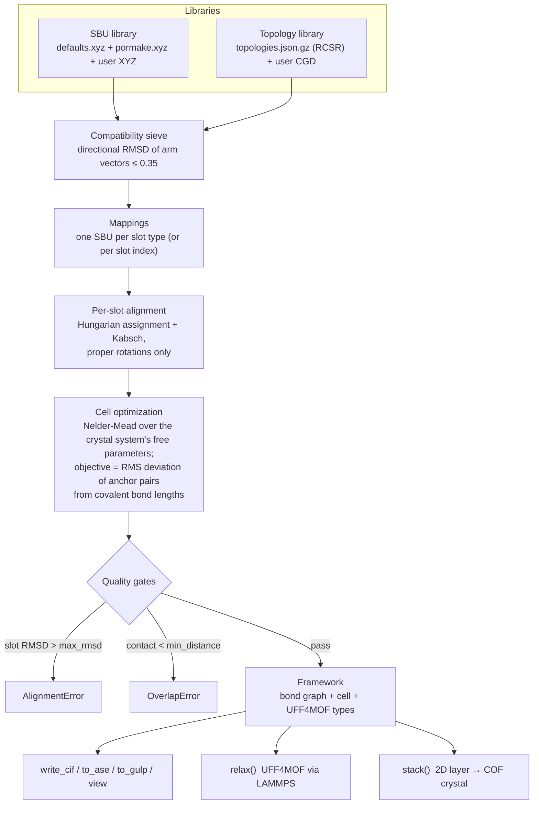
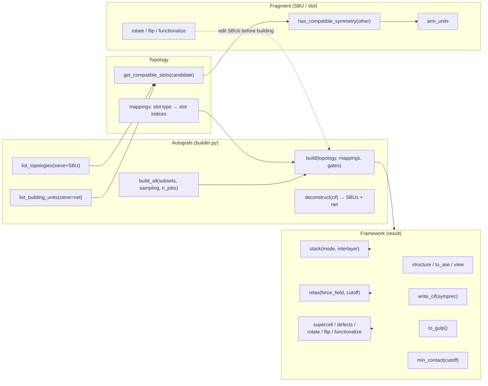
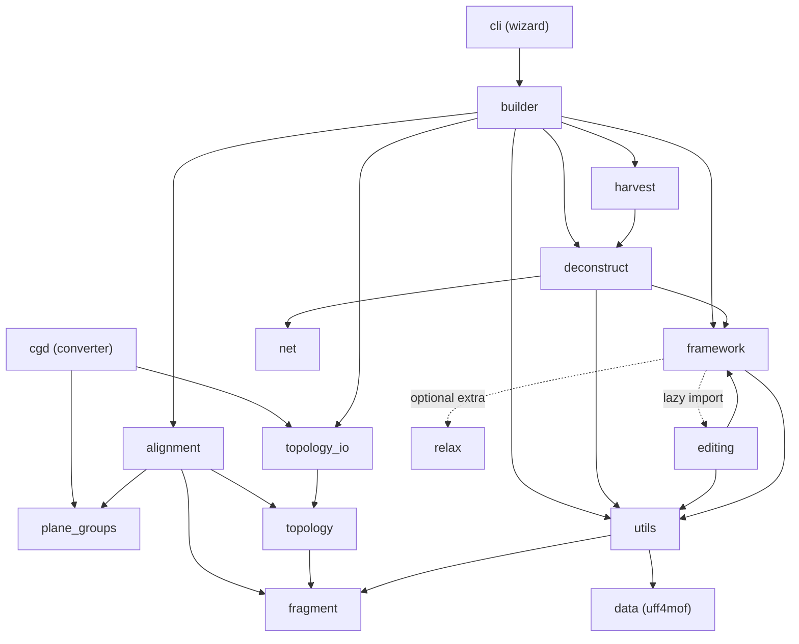

# How it works & repository architecture

*Part of the [AuToGraFS documentation](../README.md#documentation).*

## The idea (the 2014 paper)

The founding insight of the [original
publication](http://pubs.acs.org/doi/abs/10.1021/jp507643v) is a strict
separation of *chemistry* from *connectivity*. A crystalline framework is
described as a **topological blueprint** — a periodic net whose vertices and
edges are abstract *slots* annotated with connection points — plus a set of
**molecular building blocks** whose own connection points are marked by
placeholder "dummy" atoms. Generating a structure then reduces to a geometry
problem: pick a building block whose connection figure matches each slot,
align it onto the slot, and scale the cell so the blocks meet at bonding
distance. Because the blueprint is reusable, one net yields a whole
combinatorial family of hypothetical materials — MOFs, COFs, ZIFs — and
because every atom's provenance is known, the output can be automatically
typed for the UFF4MOF force field and optimized further. The paper
demonstrated this pipeline on known frameworks (MOF-5, IRMOFs, COFs) and on
the systematic enumeration of hypothetical ones.

Version 3 keeps that architecture and rebuilds the machinery: pymatgen data
structures, the full RCSR net database instead of a curated handful, geometric
(rather than symmetry-symbol) compatibility, an exact treatment of the cell
degrees of freedom per crystal system, and a bond-length-based cell objective.

## The build pipeline



Step by step:

1. **Libraries.** SBUs are pymatgen `Molecule`s with dummy atoms (`X`) marking
   connection points, wrapped in `Fragment` objects. Topologies are `Topology`
   objects: a lattice plus one slot `Fragment` per vertex/edge of the net,
   grouped into **slot types** by crystallographic orbit (all
   symmetry-equivalent slots take the same SBU).
2. **Sieve.** A slot accepts an SBU when their *unit arm vectors* — directions
   from the dummy centroid to each dummy — can be rotated onto each other to
   within a directional RMSD of 0.35. Arm *lengths* carry no chemistry (a
   blueprint's arms are arbitrary), only directions do. The threshold is
   deliberately permissive: the sieve lists what is worth attempting; strict
   acceptance happens at build time.
3. **Alignment.** For each slot, the optimal proper rotation of the SBU's arm
   vectors onto the slot's is found by iterating Hungarian assignment (which
   arm goes to which) with Kabsch superposition (the best rotation for that
   assignment), from 24 deterministic starting rotations. Improper rotations
   are excluded, so chiral SBUs are never mirrored.
4. **Cell optimization.** Every blueprint dummy is shared by the two slots it
   connects; the built structure bonds the two SBU atoms that carried those
   dummies (the *anchors*). The correct cell is the one where each anchor pair
   sits at its covalent bond length (Cordero radii). Nelder-Mead minimizes the
   RMS bond-length deviation over the crystal system's *free* parameters only —
   a cubic net optimizes one length, a triclinic net six parameters, a 2D net
   only its in-plane parameters (c stays a frozen slab padding). The whole
   objective is precomputed numpy; no pymatgen objects are built inside the
   loop.
5. **Gates.** `max_rmsd` bounds the per-slot directional mismatch
   (dimensionless; 0 = perfect shape match), `min_distance` bounds the closest
   non-bonded contact in the output, all periodic images included. Violations
   raise `AlignmentError` / `OverlapError` rather than returning bad
   structures.
6. **Result.** A `Framework`: a networkx bond graph (symbols, coordinates,
   bond orders, UFF4MOF atom types, provenance tags) with crystallographic
   views and exports on top.

## Public API at a glance



## Repository architecture

```
src/autografs/
├── builder.py       Autografs: libraries, sieve, build / build_all
├── alignment.py     numpy core: direction matching, Kabsch, cell
│                    parametrization per crystal system, BuildPlan
├── fragment.py      Fragment: Molecule + dummies, compatibility,
│                    rotate / flip / functionalize
├── topology.py      Topology: lattice + slots + orbit grouping
├── topology_io.py   versioned JSON (de)serialization, lazy library
├── framework.py     Framework: structure views, CIF/ASE/GULP export,
│                    min_contact, stack, relax, post-build editing API
├── editing.py       post-build editing: supercells, statistical
│                    defects, placed-SBU rotation/flip, functionalize
├── net.py           quotient graphs: net verification + identification
├── deconstruct.py   inverse pipeline: CIF → SBUs + net candidates
├── harvest.py       batch SBU harvesting across many structures
├── porosity.py      grid-based porosity descriptors
├── framework_io.py  Framework save/load
├── relax.py         in-process LAMMPS / UFF4MOF relaxation backend
├── elastic.py       elastic constants: stress-strain finite differences
├── plane_groups.py  the 17 plane groups, for 2D layer nets
├── cgd.py           CGD parser + `autografs-topologies` entry point
├── cli.py           interactive wizard, `autografs` entry point
├── utils.py         XYZ parsing, UFF typing, graph conversions, GULP
├── exceptions.py    AutografsError hierarchy
└── data/
    ├── defaults.xyz         63 curated SBUs
    ├── pormake.xyz          867 PORMAKE building blocks (MIT)
    ├── topologies.json.gz   2686 RCSR nets, versioned JSON
    └── uff4mof.py           UFF4MOF force-field parameters
```

Module dependencies (arrows = imports):


